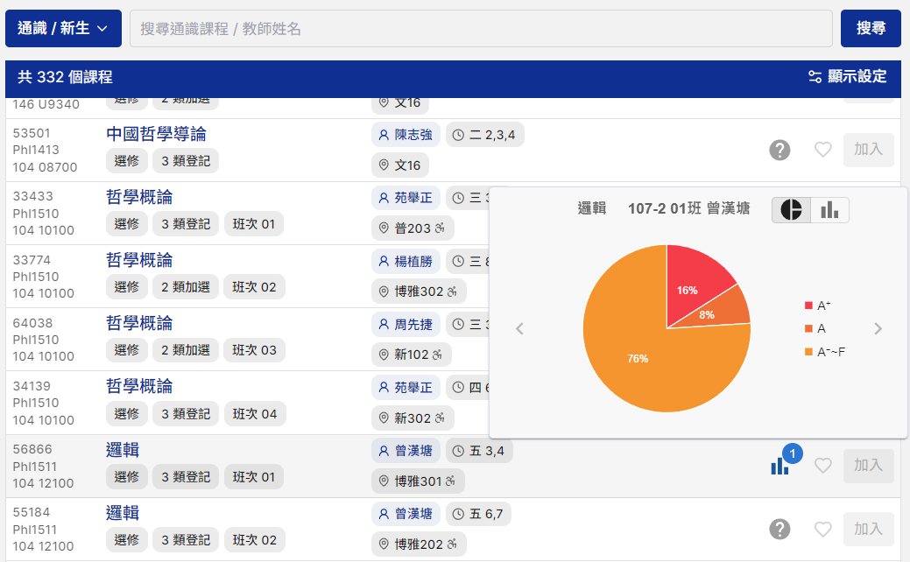
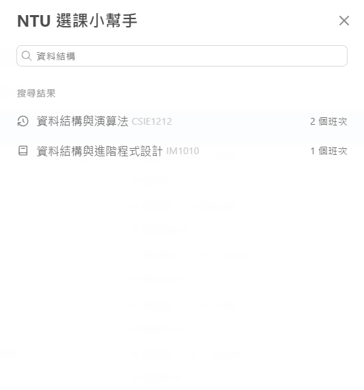
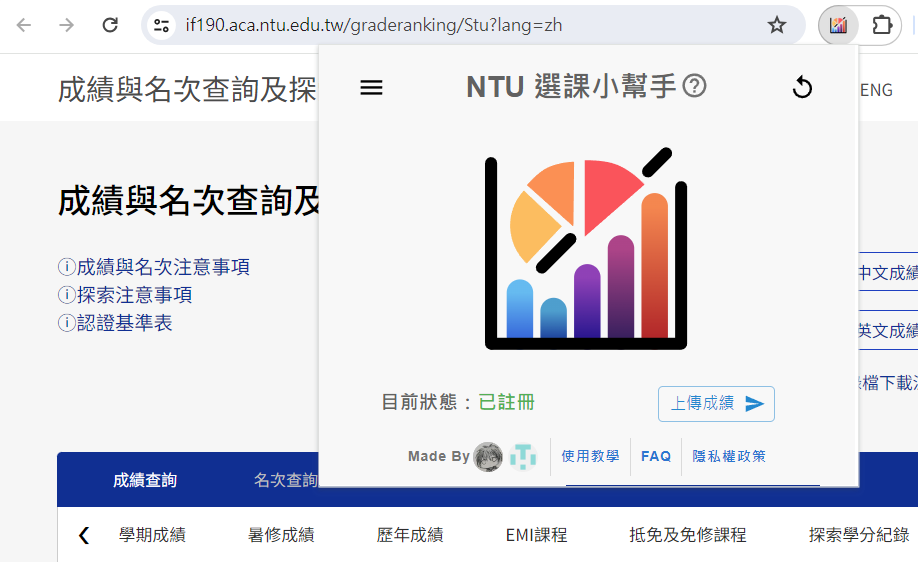

<!-- I don't know whether add this or not :( -->
<!--  -->

>
<strong>NTU選課小幫手</strong> 

>
§ <a href="https://weiiiii0622.github.io/NTU-Grade-Viewer/Tutorial/" style="font-weight: bold;">使用教學</a> | <a href="https://weiiiii0622.github.io/NTU-Grade-Viewer/FAQ/" style="font-weight: bold;">FAQ</a> | <a href="https://weiiiii0622.github.io/NTU-Grade-Viewer/Privacy-Policy/" style="font-weight: bold;">隱私權政策</a>

>
§ 下載連結：<a href="https://chromewebstore.google.com/detail/ntu-%E9%81%B8%E8%AA%B2%E5%B0%8F%E5%B9%AB%E6%89%8B/kkjggklagkgnknbnlhlocodacknhfbci" style="font-weight: bold;">Chrome 線上應用程式商店 </a>

- <a href="https://chromewebstore.google.com/detail/ntu-%E9%81%B8%E8%AA%B2%E5%B0%8F%E5%B9%AB%E6%89%8B/kkjggklagkgnknbnlhlocodacknhfbci" style="font-weight: bold;">NTU 選課小幫手</a> 是一個可以搜尋 **課程成績分布** 的 Google Chrome 插件，專門服務 **國立臺灣大學*****(NTU, National Taiwan University)*** 的學生

- 使用者可以透過以下兩種方式來查詢各項課程的成績分布：
    > 1. 進入 <a href="https://course.ntu.edu.tw/" style="font-weight: bold;">臺大新課程網</a> 查看
        
    2. 透過 **NTU選課小幫手** 的 <a href="https://weiiiii0622.github.io/NTU-Grade-Viewer/Tutorial/" style="font-weight: bold;">搜尋功能</a> 查看
          
        (詳細使用方式請參考 <a href="https://weiiiii0622.github.io/NTU-Grade-Viewer/Tutorial/" style="font-weight: bold;">使用教學</a>)

- 作為交換，使用者在使用 **NTU選課小幫手** 之前需要註冊上傳自己的成績，詳細註冊流程請參考 <a href="https://weiiiii0622.github.io/NTU-Grade-Viewer/Tutorial/" style="font-weight: bold;">使用教學</a>
  

> 對於使用者成績資料的使用我們有嚴格的規範，詳情請見 <a href="https://weiiiii0622.github.io/NTU-Grade-Viewer/Privacy-Policy/" style="font-weight: bold;">隱私權政策</a>

