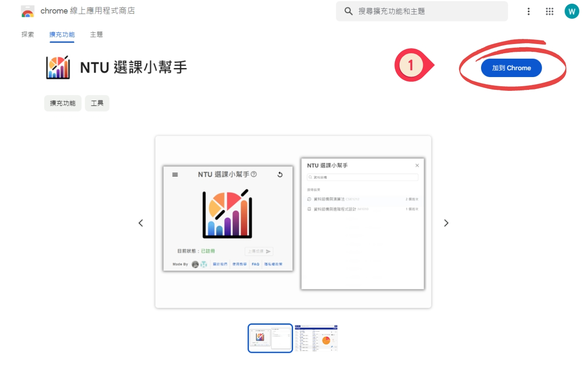
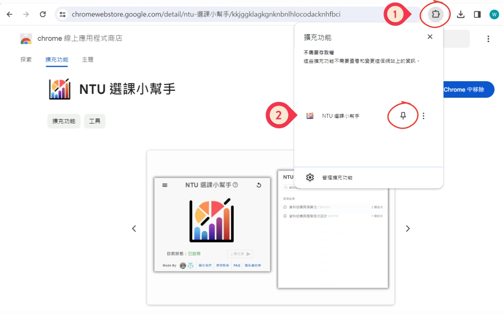
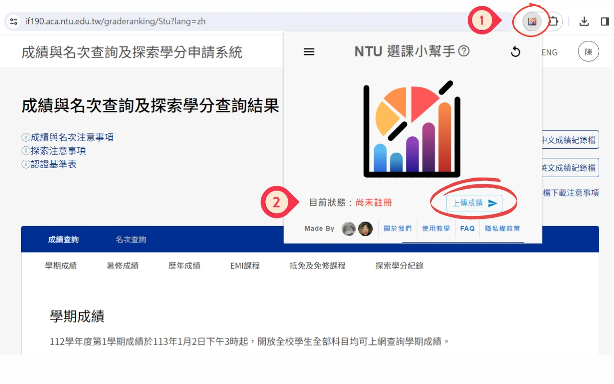
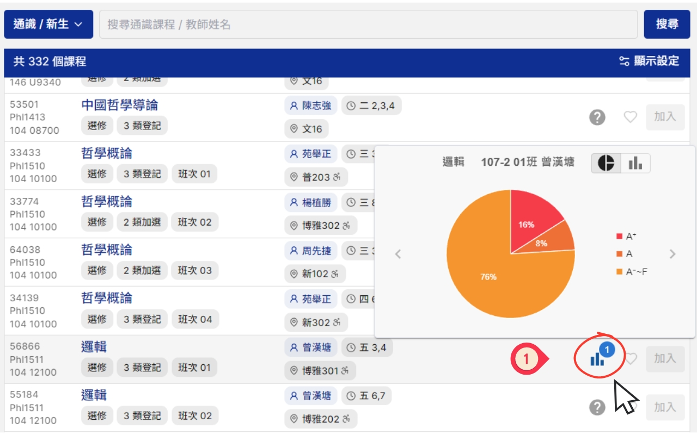
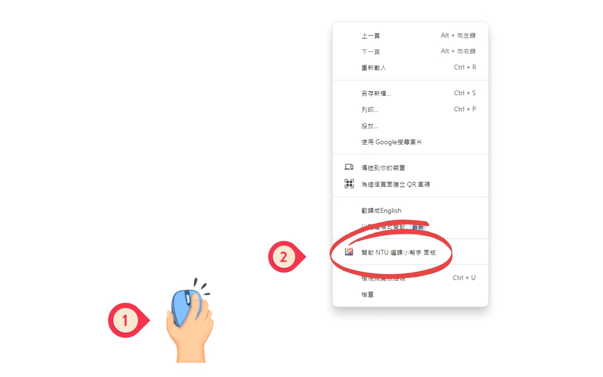
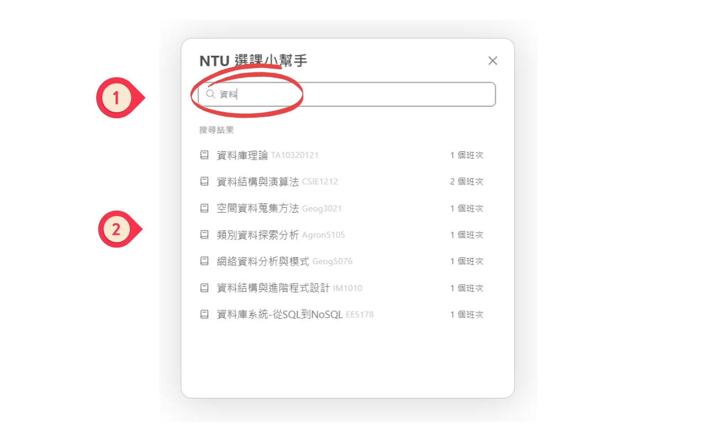
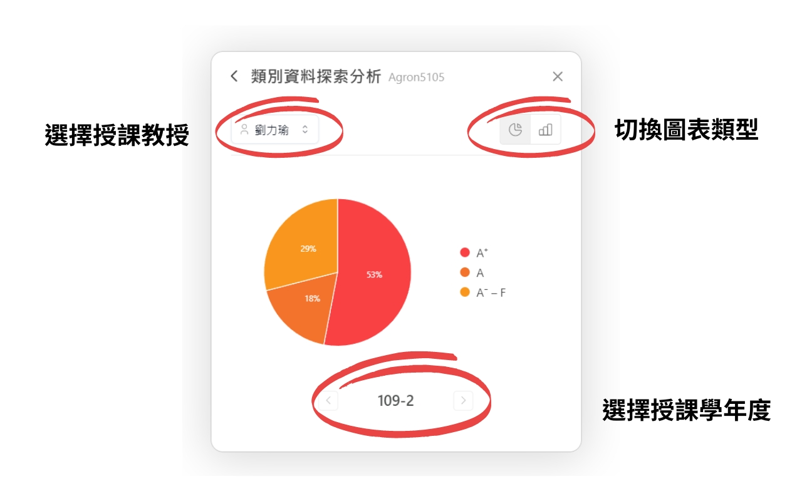

> ## ✯ 首次使用
### ➢ **Step 1. 下載 NTU 選課小幫手**
§ **下載連結**： <a href="https://chromewebstore.google.com/detail/ntu-%E9%81%B8%E8%AA%B2%E5%B0%8F%E5%B9%AB%E6%89%8B/kkjggklagkgnknbnlhlocodacknhfbci">*Chrome 線上應用程式商店*</a>
  

### ➢ **Step 2. (Optional) 釘選 NTU 選課小幫手** 

### ➢ **Step 3.  註冊 NTU 選課小幫手**
1. 前往 <a href="https://if190.aca.ntu.edu.tw/graderanking/index">成績與名次查詢及探索學分申請系統</a>
2. 在成績查詢頁面上，點選NTU選課小幫手上的「**上傳成績**」

3. 等待數秒後，若顯示「<a style="color: green;">**已註冊**</a>」則代表註冊成功。<a style="color: #d62828;">**無法註冊** </a>請參考「<a href="https://weiiiii0622.github.io/NTU-Grade-Viewer/FAQ/#疑難排解">**疑難排解**</a>」

> ## ✯ 查詢成績圖表
### ➢ 1. **臺大新課程網**
1. 前往 <a href="https://course.ntu.edu.tw/">臺大新課程網</a>
2. 搜尋任一課程即會在課程欄位右側出現圖表符號，將滑鼠移上去即會顯示成績圖表
  

### ➢ 2. **NTU選課小幫手**
1. 在任一網頁中點擊 **滑鼠右鍵** 或是使用鍵盤快捷鍵 「**Alt+G**」，
並點選「**開啟 NTU選課小幫手 面板**」
(無法在google搜尋主頁或是 "chrome://" 開頭的頁面使用)
2. 搜尋任一課程的名字，在下方點選您想查詢的課程

3. 查看該課程之詳細課程圖表，點擊左上角按鈕返回搜尋頁面
